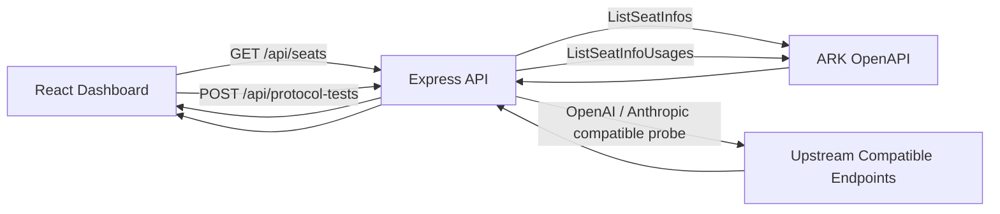

# SeatsUsage

一个面向火山方舟 Coding Plan 的本地席位用量看板。项目使用 React + Vite 构建前端，使用 Express 作为本地 API 代理，负责签名调用火山方舟 OpenAPI，汇总有效席位的近 5 小时、近 7 天、近 30 天用量，并提供协议兼容性测试与接入指引页面。

## Overview

- 查询火山方舟 Coding Plan Pro 席位，并展示当前有效席位
- 聚合展示 5 小时、7 天、30 天三个时间窗口的用量
- 通过本地服务代理 OpenAPI 请求，避免 AK/SK 直接进入浏览器
- 内置 OpenAI / Anthropic 兼容协议探测
- 提供 Claude Code、Codex、OpenCode、VS Code Copilot 的接入示例
- 支持一键复制 Base URL、API Key、模型名等常用配置

## Features

### 1. 席位用量看板

- 自动拉取席位列表与席位用量
- 仅展示状态为有效的席位
- 使用环形刻度展示不同时间窗口的占用比例
- 展示套餐生效时间区间

### 2. 协议可用性测试

- 调用三个兼容接口进行低 token 探测请求
- 支持的测试协议：
	- OpenAI Chat Completions
	- OpenAI Responses
	- Anthropic Messages
- 返回协议状态、响应延迟、HTTP 状态码与响应摘要

### 3. 接入配置指南

- 页面内置多客户端接入示例
- 当前包含：
	- Claude Code
	- Codex
	- OpenCode
	- VS Code Copilot

## Tech Stack

- Frontend: React 19, React DOM, Vite, TypeScript
- Backend: Express 5, dotenv
- Concurrency: concurrently
- API: 火山方舟 OpenAPI（本地签名请求）

## Quick Start

### Prerequisites

- Node.js 20+
- npm 10+
- 可访问火山方舟 OpenAPI 的账号凭据

### 1. Install

```bash
npm install
```

### 2. Configure environment

复制示例配置：

```bash
cp .env.example .env
```

然后填写火山引擎访问凭据：

```env
VOLCENGINE_ACCESS_KEY_ID=your-access-key-id
VOLCENGINE_SECRET_ACCESS_KEY=your-secret-access-key
```

如果使用临时凭据，也可以额外配置：

```env
VOLCENGINE_SESSION_TOKEN=your-session-token
```

### 3. Start development

```bash
npm run dev
```

默认会同时启动：

- 前端开发服务器: http://localhost:5173
- 本地 API 服务: http://localhost:8787

### 4. Build

```bash
npm run build
```

### 5. Preview production build

```bash
npm run preview
```

`preview` 会启动 Express 服务，并托管 dist 目录中的静态文件。

## Environment Variables

以下变量已在当前实现中使用：

| 变量名 | 默认值 | 说明 |
| --- | --- | --- |
| VOLCENGINE_ACCESS_KEY_ID | - | 火山引擎 Access Key ID |
| VOLCENGINE_SECRET_ACCESS_KEY | - | 火山引擎 Secret Access Key |
| VOLCENGINE_SESSION_TOKEN | - | 临时凭据的 Session Token，可选 |
| ARK_REGION | cn-beijing | 签名区域 |
| ARK_SERVICE | ark | 签名服务名 |
| ARK_OPENAPI_HOST | ark.cn-beijing.volcengineapi.com | OpenAPI 主机名 |
| ARK_OPENAPI_VERSION | 2024-01-01 | OpenAPI 版本 |
| ARK_PROJECT_NAME | default | 项目标识 |
| ARK_BIZ_INFO | Pro | 席位档位过滤条件 |
| ARK_PAGE_SIZE | 1000 | ListSeatInfos 分页大小 |
| ARK_USAGE_BATCH_SIZE | 1000 | ListSeatInfoUsages 的 SeatIDs 批量大小 |
| PORT | 8787 | 本地 Express 服务端口 |

后端同时兼容多组凭据别名：

- Access Key ID: VOLCENGINE_ACCESS_KEY_ID / VOLCENGINE_ACCESS_KEY / ARK_ACCESS_KEY_ID / VOLC_ACCESSKEY
- Secret Access Key: VOLCENGINE_SECRET_ACCESS_KEY / VOLCENGINE_SECRET_KEY / ARK_SECRET_ACCESS_KEY / VOLC_SECRETKEY
- Session Token: VOLCENGINE_SESSION_TOKEN / VOLCENGINE_SECURITY_TOKEN / ARK_SECURITY_TOKEN / VOLC_SESSION_TOKEN

## How It Works



请求流程分为两部分：

### 席位查询

1. 前端请求 `/api/seats`
2. 后端调用 `ListSeatInfos`，按 `ProjectName` 与 `BizInfo` 过滤并自动翻页
3. 后端提取全部 `SeatID`，分批调用 `ListSeatInfoUsages`
4. 后端合并席位信息与用量信息，只返回前端需要的字段
5. 前端渲染席位表格、概览指标和生效时间

### 协议探测

1. 前端触发 `/api/protocol-tests`
2. 后端分别向三种兼容协议端点发起最小请求
3. 返回每种协议的可用状态、响应时延与响应摘要

## API

### GET /api/health

健康检查接口。

响应示例：

```json
{
	"ok": true
}
```

### GET /api/seats

返回归一化后的席位列表与元信息。

响应字段包括：

- seats: 席位数组
- fetchedAt: 后端拉取时间
- projectName: 当前项目名
- bizInfo: 当前档位过滤值
- rawSeatCount: 原始返回席位数

### POST /api/protocol-tests

触发兼容协议测试。

响应字段包括：

- testedAt: 测试时间
- model: 当前测试模型
- results: 每种协议的测试结果

## Available Scripts

```bash
npm run dev
npm run dev:api
npm run dev:web
npm run build
npm run preview
```

说明：

- `dev`: 同时启动前后端
- `dev:api`: 只启动本地 Express API
- `dev:web`: 只启动 Vite 前端
- `build`: 执行 TypeScript 编译并构建前端产物
- `preview`: 启动 Express，并托管生产构建结果

## Project Structure

```text
.
├─ public/
├─ server/
│  └─ index.js
├─ src/
│  ├─ main.tsx
│  └─ style.css
├─ index.html
├─ package.json
├─ README.md
├─ tsconfig.json
└─ vite.config.ts
```

关键文件：

- `server/index.js`: OpenAPI 签名、席位聚合、本地接口、协议测试
- `src/main.tsx`: 页面数据加载、概览卡片、席位表格、接入指南、协议测试 UI
- `src/style.css`: 整体视觉样式与响应式布局

## Current Implementation Notes

当前仓库中的实现还带有一些明显的产品化边界，README 这里直接说明，避免误解：

- 协议测试配置当前写在后端常量中，而不是环境变量
- 接入教程和复制卡片中的 Base URL、API Key、模型列表当前写在前端常量中
- 页面默认面向 `ARK_BIZ_INFO=Pro` 的使用场景
- 预览模式依赖先执行 `npm run build` 生成 dist

如果你计划把这个项目用于团队内部长期维护，优先建议把协议测试配置和接入示例改造成环境变量或服务端配置下发。

## Troubleshooting

### 启动后页面加载失败

优先检查：

- `.env` 是否存在且凭据填写正确
- 本地 8787 端口是否被占用
- 火山方舟 OpenAPI 域名是否可访问

### 返回缺少凭据

项目会在后端缺少凭据时直接报错。至少需要配置：

- `VOLCENGINE_ACCESS_KEY_ID`
- `VOLCENGINE_SECRET_ACCESS_KEY`

### 协议测试失败

可能原因：

- 上游兼容接口不可达
- 内置测试 API Key 不可用
- 模型或协议返回结构与当前校验逻辑不匹配

## License

当前仓库未声明许可证。如需开源发布，建议补充明确的 LICENSE 文件。
